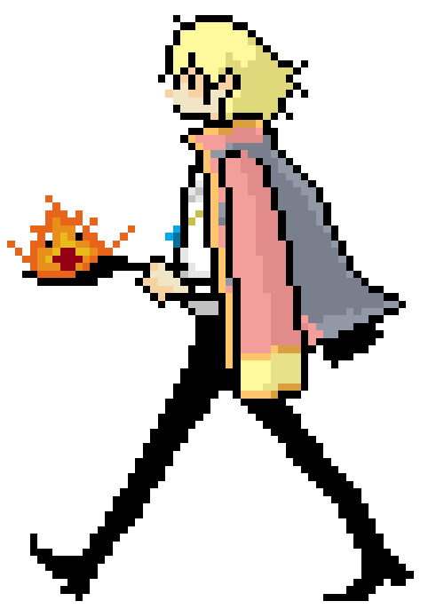

### hello, wellcome to my profile! ✨

##

  <a href="https://beacons.ai/eulauragabriel">
  
  

##
  
  
<b>software  development student currently learning ✨</b>

  

##
  
<b>contact info ✨</b>

  

   
  

