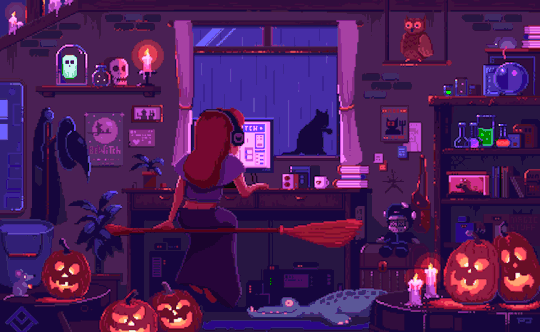

### hello, wellcome to my profile! ✨

##

<b>software  development student currently learning:</b>

  

##

  <a href="https://beacons.ai/eulauragabriel">
  
  

<b>software  development student</b>
